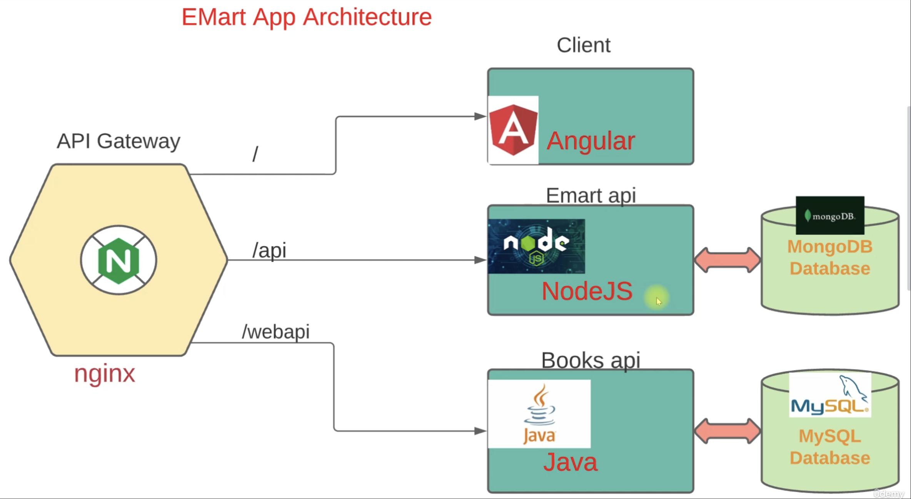
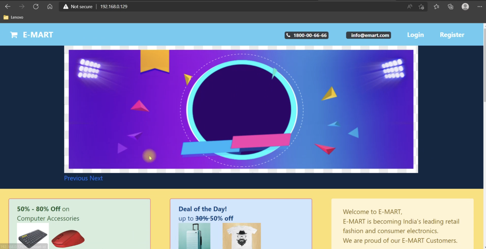

# 🛒 EMart Microservices Application

> **Learn containerization using Docker and Vagrant by hosting the EMart microservices e-commerce application in isolated containers.**


## 🧭 Overview

### 🎯 **Aim**
Learn containerization using **Docker** and **Vagrant** by deploying the EMart microservices-based e-commerce platform in isolated, manageable environments.

### 🧩 **Description**
EMart is a **modular, microservices-based e-commerce application** inspired by platforms like **Amazon** and **Flipkart**.  
Its architecture, deployment setup, and orchestration are designed for hands-on learning in:
- Containerization (Docker)
- Scalable systems practice
- Microservices communication and orchestration

---

## 📚 Table of Contents

1. [Project Architecture](#-1-project-architecture)
2. [Getting Started](#-2-getting-started)
3. [Virtual Machine Setup (Vagrant)](#-3-virtual-machine-setup-vagrant)
4. [Container Orchestration (Docker Compose)](#-4-container-orchestration-docker-compose)
5. [Running the Application](#-5-running-the-application)
6. [Scaling, Extending, & Maintenance](#-6-scaling-extending--maintenance)
7. [Cleanup Procedure](#-7-cleanup-procedure)


---

## ⚙️ 1. Project Architecture

### 🗺️ **System Diagram**
Refer to the architecture diagram for interaction flow and microservice separation.




### 🧠 **Service Roles**

| Service                   | Role              | Description                                                                           |
|---------------------------|-------------------|---------------------------------------------------------------------------------------|
| **nginx (API Gateway)**   | Traffic Router    | Routes traffic to endpoints (`/` for client, `/api` for NodeJS, `/webapi` for Java).  |
| **Angular (Client)**      | Web UI            | Frontend interface, consumes backend services via API Gateway.                        |
| **NodeJS (Emart API)**    | Core API          | Handles primary e-commerce logic, connects to MongoDB.                                |
| **Java (Books API)**      | Secondary API     | Dedicated books microservice, uses MySQL database.                                    |
| **MongoDB/MySQL**         | Databases         | Independent databases for each backend service.                                       |

---

## 🧰 2. Getting Started

### 🧾 **Prerequisites**

#### 🖥️ Host OS
- Any modern OS (tested on **Windows**, **Linux**, **Mac**)

#### 🧑‍💻 Software Requirements
- [Vagrant](https://www.vagrantup.com/) – VM management  
- [VMware](https://www.vmware.com/) / [VirtualBox](https://www.virtualbox.org/) – VM provider  
- [Git](https://git-scm.com/) – Source control  
- **Docker** & **Docker Compose** (installed inside VM)

---

### 🗂️ Folder Structure Example

```text
eMart-microservices-containers/
│
├── client/            # Angular app
├── javaapi/           # Java Books API
├── nodeapi/           # NodeJS Emart API
├── nginx/             # Nginx config
├── vagrantfiles_dock/ # vagrantfile config
├── docker-compose.yaml
└── README.md
```
## 🏗️ 3. Virtual Machine Setup (Vagrant)

### ⚡ Installation

Download and install Vagrant from the official website.

### 🧩 VM Configuration

- **Box**: Ubuntu ARM (`spox/ubuntu-arm`, version 1.0.0)
- **RAM**: 2 GB
- **Network**: Private + Bridged IP (192.168.56.82)
- **Provisioner**: Installs Docker & Docker Compose automatically

## 🐳 4. Container Orchestration (Docker Compose)

### 📄 Compose File Reference

See: `docker-compose.yaml`

Defines:
- Service containers
- Build contexts  
- Ports and dependencies
- Environment variables

### 🧱 Service Summary

| Service | Stack/Path   | Purpose  | Exposed Port | DB       | DB Port |
|---------|--------------|----------|--------------|----------|---------|
| nginx   | nginx:latest | Gateway  | 80            | —       | —       |
| client  | ./client     | UI       | 4200          | —       | —       |
| api     | ./nodeapi    | Shop API | 5000          | MongoDB | 27017   |
| webapi  | ./javaapi    | Books API| 9000          | MySQL   | 3306    |
| emongo  | mongo:4      | Database | 27017         | —       | —       |
| emartdb | mysql:8.0.33 | Database | 3306          | —       | —       |


## 🚀 5. Running the Application

### 🪜 Step-by-Step Guide

#### 1️⃣ Spin up the virtual machine
```bash
vagrant up
vagrant ssh
sudo -i    # Become root if needed
```

#### 2️⃣ Clone project repo
```bash
git clone git@github.com:ajaykrishnavemula/eMart-microservices-containers.git
cd eMart-microservices-containers/
```
#### 3️⃣ Build and start containers
```bash
docker-compose up -d
```
- If build fails:
```bash
docker-compose build
docker-compose up -d
```
#### 4️⃣ Verify running containers
```bash
docker ps
docker-compose ps
```

- ✅ You should see: client, api, webapi, nginx, emongo, emartdb.

#### 5️⃣ Get VM IP for browser access
```bash
ip a    # Look for IP (e.g. 192.168.56.82)
```
#### 6️⃣ Access EMart in browser
```bash
http://<VM-IP>
```

- **Default port:** 80 (nginx reverse proxy)
- **Angular UI with:**
  - Login/Register → NodeJS API
  - Book operations → Java API



## 🔧 6. Scaling, Extending, & Maintenance

- Add new microservices via `docker-compose.yaml` and Nginx routes
- Swap or upgrade databases independently
- Restart policies ensure recovery:
```bash
restart: always
```
- Ideal for studying scalable, loosely-coupled app deployments

## 🧹 7. Cleanup Procedure
### 🧼 Stop and remove containers
```bash
docker-compose down
```

**Thank you for exploring this project! Feel free to reach out or contribute. 🌟**

